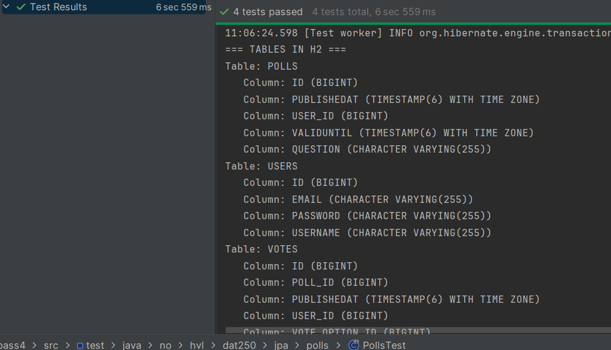

DAT250 – Experiment Assignment 4
Technical problems and solutions:

Working with Hibernate was relatively simple once things were set up, 
but I discovered that small details must be exactly correct, otherwise nothing works.
One issue I struggled with was the voteFor method and the way options were queried in the tests.
The logic in my domain model was based on using the caption of each VoteOption to distinguish between alternatives,
but the testVotes method relied on a presentationOrder field that my entities did not actually support.
Because of this mismatch, the counting queries in the tests did not return the expected results.
After aligning the model and the test so that both consistently use the same property to identify options,
the votes were counted correctly and the tests passed.

Another challenge was transitioning from a pure domain model to an entity model with JPA. 
Adding the correct annotations (@Entity, @Id, @GeneratedValue, relationships such as @OneToMany) was easy but tricky.
In hindsight, it would probably be easier to decide on the persistence model early in the design phase, 
so the domain model can be designed with database mapping in mind from the beginning.

My code for this experiment (including the passing test case) can be found here:
https://github.com/KamilMatyjaszczyk/expass4

Database inspection:
To inspect the database, I used both SQL queries inside the test code (SHOW TABLES, SHOW COLUMNS) and the H2 in-memory console. 
Hibernate automatically generated tables corresponding to my entities:

USERS
POLLS
VOTES
VOTEOPTION
In addition, foreign key columns were added to represent the relationships.
Here is a screenshot showing the actual tables and columns created in my in-memory H2 database during test execution:

This confirmed that Hibernate correctly mapped my JPA entities to the database structure, and that the inserted test data was persisted.

Pending issues: 
At this point, all test cases are green, but I still have some open questions:
I am not entirely sure what the best practice is for organizing entity relationships in larger projects.
