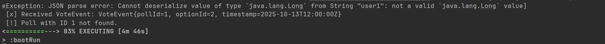

Current Status and Remaining Issue

I have successfully connected RabbitMQ with the PollApp, and I am able to send and receive messages through the RabbitMQ management interface.
However, due to compatibility problems between the frontend application and the backend introduced after the changes made between Expass 3 and Expass 4 related to the switch from string-based IDs to Long IDs,
I am currently unable to verify that the entire end-to-end scenario works as intended.

At the moment, the ID mismatch issue must be resolved before I can perform a full integration test of the system, 
including the voting workflow through the frontend.
Due to other compulsory assignments, I was unable to fully complete this exercise and reach the intended goals of this experiment.
